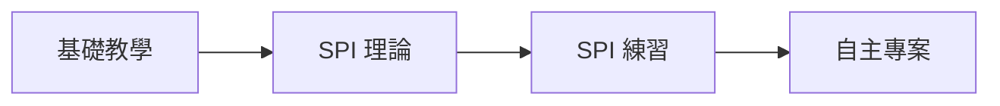

# 📚 Tutorials - 教學文件

本章節提供循序漸進的教學材料，特別適合初學者和想要深入了解特定主題的讀者。

## 📖 本章節文件

| 文件 | 說明 | 預估時間 | 難度 |
|------|------|----------|------|
| [01_basic_tutorial.md](01_basic_tutorial.md) | 基礎入門教學 | 1 小時 | ⭐ |
| [02_understanding_spi.md](02_understanding_spi.md) | SPI 通訊深入解析（5000+ 字） | 2 小時 | ⭐⭐ |
| [03_spi_practice_workbook.md](03_spi_practice_workbook.md) | SPI 實作練習題 | 3 小時 | ⭐⭐⭐ |

## 🎯 學習目標

### 基礎教學
- 了解專案結構
- 學會執行模擬
- 基本波形觀察

### SPI 通訊專題
- 深入理解 SPI 協定
- 透過實例學習時序
- 動手實作加深印象

### 實作練習
- 6 個漸進式練習
- 從觀察到實作
- 綜合挑戰專案

## 📝 建議學習順序

1. **第一週**：完成基礎教學
2. **第二週**：閱讀 SPI 理論文件
3. **第三週**：完成所有練習題
4. **第四週**：設計自己的模組

## 🏆 學習里程碑

- [ ] 能夠執行 testbench
- [ ] 理解 SPI 四條線的作用
- [ ] 能在 GTKWave 測量時序
- [ ] 完成多通道讀取練習
- [ ] 實作錯誤處理機制
- [ ] 設計溫度趨勢分析器

## 💡 學習建議

1. **動手做**：不要只是閱讀，實際執行程式碼
2. **問為什麼**：理解每個設計決定背後的原因
3. **做筆記**：記錄學習過程中的疑問和心得
4. **討論交流**：與他人分享學習經驗

## 🔗 延伸學習

完成教學後，可以：
- 研究 [設計文件](../02_design/) 深入了解實作
- 嘗試 [驗證策略](../03_verification/) 中的進階技巧
- 挑戰 [物理設計](../05_implementation/) 的後端流程

---

[返回主目錄](../README.md)