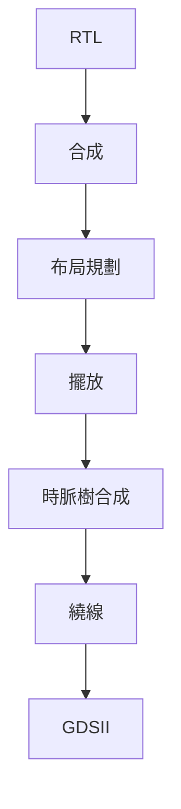

# 🏭 Implementation Documentation - 實作文件

本章節涵蓋從 RTL 到 GDSII 的完整後端實作流程，使用 SKY130 PDK。

## 📖 本章節文件

| 文件 | 說明 | 工具 |
|------|------|------|
| [01_physical_design_guide.md](01_physical_design_guide.md) | 物理設計指南與優化技巧 | OpenLane |
| [02_synthesis_guide.md](02_synthesis_guide.md) | Yosys 合成流程詳解 | Yosys |
| [03_openlane_guide.md](03_openlane_guide.md) | OpenLane 自動化流程設定 | OpenLane |

## 🎯 實作流程



## 🔧 關鍵步驟

### 1. 合成階段
- RTL 到閘級網表轉換
- 面積與時序優化
- 技術映射

### 2. 物理設計
- 布局規劃 (Floorplan)
- 標準元件擺放 (Placement)
- 時脈樹合成 (CTS)
- 繞線 (Routing)

### 3. 驗證與簽核
- DRC 檢查
- LVS 驗證
- 時序分析
- 功耗分析

## 📊 效能指標

| 指標 | 目標值 | 實際值 |
|------|--------|--------|
| 面積 | < 0.5 mm² | 待測 |
| 功耗 | < 10 mW | 待測 |
| 時脈 | 10 MHz | 達成 |

## 💡 優化建議

1. **面積優化**
   - 共享資源
   - 使用更小的標準元件
   - 優化布局利用率

2. **時序優化**
   - 插入緩衝器
   - 調整關鍵路徑
   - 優化時脈樹

3. **功耗優化**
   - 時脈閘控
   - 多電壓域設計
   - 降低切換活動

## 🚀 快速開始

```bash
# 執行合成
cd synthesis
make synth

# 執行 OpenLane 流程
cd ../openlane
make mount
flow.tcl -design temp_controller
```

## 🔗 相關資源

- [SKY130 PDK 文件](https://skywater-pdk.readthedocs.io/)
- [OpenLane 文件](https://openlane.readthedocs.io/)
- [Yosys 手冊](http://www.clifford.at/yosys/)

---

[返回主目錄](../README.md)